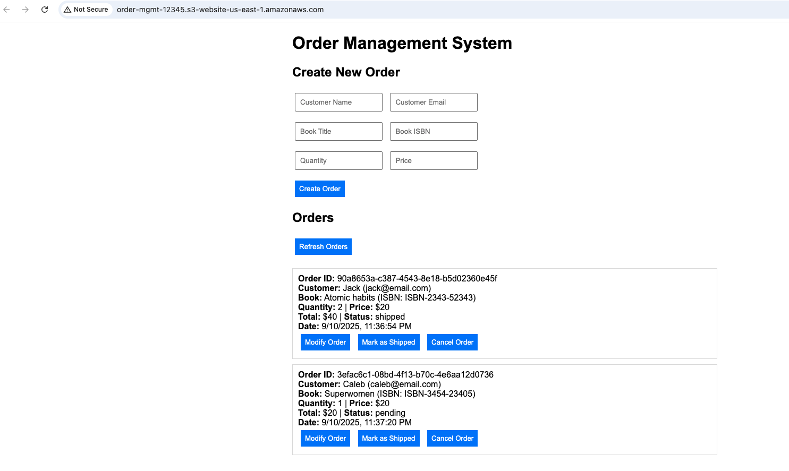

# Order Management System

A serverless order management system built with AWS Lambda, API Gateway, and S3 static website hosting.

## 🏗️ Architecture

- **Frontend**: S3 Static Website (HTML/CSS/JS)
- **Backend**: AWS Lambda Function
- **API**: API Gateway with CORS enabled
- **Storage**: In-memory mock data store

## 📱 User Interface



## 🚀 Features

- ✅ Create new orders
- ✅ View all orders (including cancelled)
- ✅ Modify order details (quantity, price)
- ✅ Update order status to "shipped"
- ✅ Cancel orders (marks as "cancelled" instead of deleting)

## 📁 Project Structure

```
OrderManagement/
├── backend/
│   ├── lambda_function.py    # AWS Lambda function code
│   └── requirements.txt      # Python dependencies
├── frontend/
│   └── index.html           # Static website
├── docs/
│   └── architecture.png     # System architecture diagram
└── README.md
```

## 🔗 API Endpoints

| Method | Endpoint | Description |
|--------|----------|-------------|
| GET    | `/orders` | List all orders |
| POST   | `/orders` | Create new order |
| PUT    | `/orders/{id}` | Update order details/status |
| DELETE | `/orders/{id}` | Cancel order (marks as cancelled) |

## 🌐 Live Demo

- **Website**: https://your-cloudfront-distribution.cloudfront.net
- **API**: https://your-api-gateway-id.execute-api.region.amazonaws.com/prod

## 📱 User Interface

### Order Management Dashboard


The web interface provides:
- **Create Order Form**: Customer details, book information, quantity and pricing
- **Order List**: View all orders with complete details
- **Order Actions**: 
  - Modify Order (update quantity/price)
  - Mark as Shipped (status update)
  - Cancel Order (marks as cancelled)
- **Real-time Updates**: Refresh button to reload order list

### Sample Order Display
```
Order ID: 6a0b9d05-a45d-4bee-b9d8-c0d166fc7f02
Customer: John Doe (john@example.com)
Book: Python Programming (ISBN: 978-1234567890)
Quantity: 2 | Price: $29.99
Total: $59.98 | Status: pending
Date: 1/10/2025, 2:30:00 PM
[Modify Order] [Mark as Shipped] [Cancel Order]
```

## 🛠️ Deployment Instructions

### Option 1: CloudFormation (Recommended)

**One-click deployment with infrastructure as code:**

```bash
# Deploy the complete stack
aws cloudformation create-stack \
  --stack-name order-management-system \
  --template-body file://cloudformation-template.yaml \
  --parameters ParameterKey=BucketName,ParameterValue=my-order-system \
  --capabilities CAPABILITY_IAM

# Upload frontend after stack creation
aws s3 cp frontend/index.html s3://BUCKET_NAME/ --content-type "text/html"
```

See [deployment-instructions.md](deployment-instructions.md) for detailed steps.

### Option 2: Manual Setup

**Step-by-step manual deployment:**

1. **Deploy Lambda Function**
   - Create AWS Lambda function with Python 3.9 runtime
   - Upload `backend/lambda_function.py` as function code
   - Set handler to `lambda_function.lambda_handler`

2. **Setup API Gateway**
   - Create REST API in API Gateway
   - Create `/orders` resource with GET, POST methods
   - Create `/orders/{id}` resource with PUT, DELETE methods
   - Enable CORS for all methods

3. **Deploy Frontend**
   - Create S3 bucket with static website hosting
   - Upload `frontend/index.html` to bucket
   - Set bucket policy for public read access

## 💻 Frontend Code Preview

### HTML Structure
The `frontend/index.html` contains:

```html
<!DOCTYPE html>
<html>
<head>
    <title>Order Management System</title>
    <style>
        body { font-family: Arial, sans-serif; margin: 20px; }
        .container { max-width: 800px; margin: 0 auto; }
        .order { border: 1px solid #ddd; padding: 10px; margin: 10px 0; }
    </style>
</head>
<body>
    <div class="container">
        <h1>Order Management System</h1>
        
        <!-- Order Creation Form -->
        <h2>Create New Order</h2>
        <form id="orderForm">
            <input type="text" placeholder="Customer Name" required>
            <input type="email" placeholder="Customer Email" required>
            <input type="text" placeholder="Book Title" required>
            <input type="number" placeholder="Quantity" required>
            <button type="submit">Create Order</button>
        </form>

        <!-- Orders Display -->
        <h2>Orders</h2>
        <button onclick="loadOrders()">Refresh Orders</button>
        <div id="orders"></div>
    </div>
</body>
</html>
```

### JavaScript Features
- AJAX calls to API Gateway endpoints
- Dynamic order list rendering
- Form validation and submission
- Order modification with prompts
- Status updates and cancellation

## 📊 Order Data Structure

```json
{
  "order_id": "uuid-string",
  "customer_name": "John Doe",
  "customer_email": "john@example.com",
  "book_title": "Sample Book",
  "book_isbn": "978-1234567890",
  "quantity": 2,
  "price": "29.99",
  "total_amount": "59.98",
  "order_date": "2025-01-10T19:30:00.123456",
  "status": "pending"
}
```
